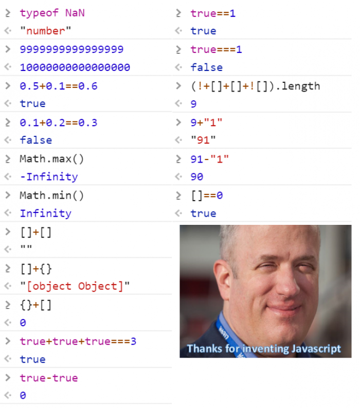

##  Dear Java: thank u, next. 

Dangerous, dynamic, adaptable, non-conforming, and vague are adjectives you'd think would be used to describe a "bad boy" that your parents warned you about to never date. In this case, that "bad boy" is Javascript. Coming from a Java and C/C++ perspective, little did I know that Javascript is what I have been yearning for in the long, arduous nights that I wasted with Java defining types, structuring classes with predefined feilds, and being stuck with a single return type for functions.

Goodbye Java, I've found a more understanding and less strict and controlling programming language. This new language doesn't expect much from me, especially when I don't have to define types anymore, but we still can make it work. Also, this new language accepts me for my small mistakes that I make, such as forgetting a semicolon. Java would have thrown a fit with a Syntax Error. Ariana Grande expressed her feelings about her exes in her "thank u, next" video: 

```
one taught me love
one taught me patience
and one taught me pain
```

I couldn't agree more with Ms. Grande. Java has taught me to love, patience, and pain, but Javascript has allured me with its potential and possibilities. 

#### HashMap, Who??

Another quirk about Javascript I love already is how you can simply use objects to store keys paired with values. In Java, to store a key/value database, you would use the HashMap class.


## Looks like I won't be hitting up the Gym

After all these years I can finally make my parents proud and tell them I'm athletic. I quite enjoy athletic software engineering, since it mimics real life situations where we would have a project deadline that requires you to work under pressure and not waste time. The workouts require you to be well acquainted with the language beforehand in order to quickly solve a challenge. 
