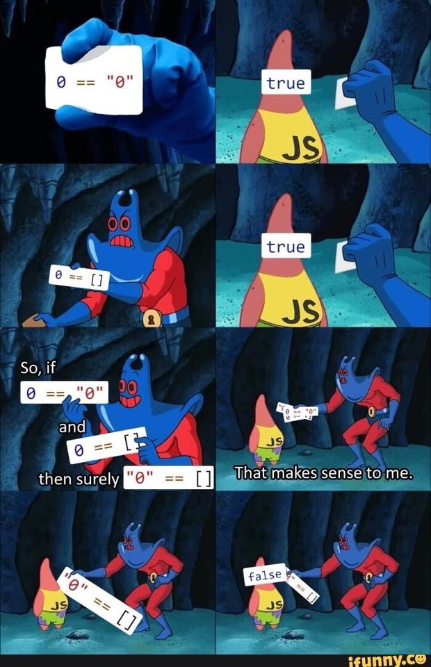

##  Javascript: Now that's Wild

Dangerous, dynamic, adaptable, non-conforming, and vague are adjectives you'd think would be used to describe a "bad boy" that your parents warned you about to never date. In this case, that "bad boy" is Javascript. Coming from a Java and C/C++ perspective, little did I know that Javascript is what I have been yearning for in the long, arduous nights that I wasted with Java defining types and structuring classes with predefined feilds.  


Equality Operators
```
// math
x = y

// java
x == y

// javascript
x === y

```

## Athletic Software Engineering


