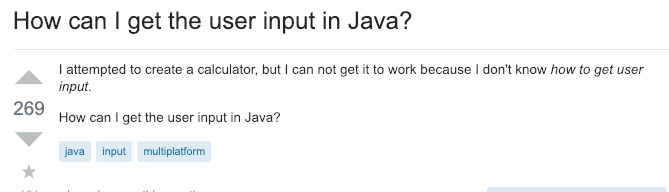
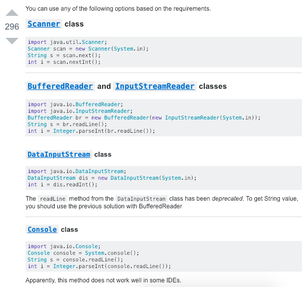

##  The difference between a noob and a newbie
Although both terms mean someone who is unfamiliar with something, the characterizing difference of a noob and a newbie is their attitude and approach to asking for help.

## Noobs

## Newbies

