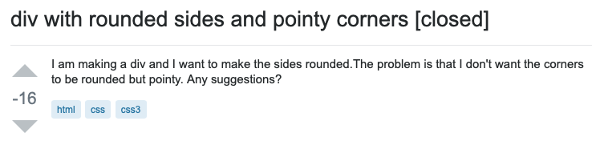
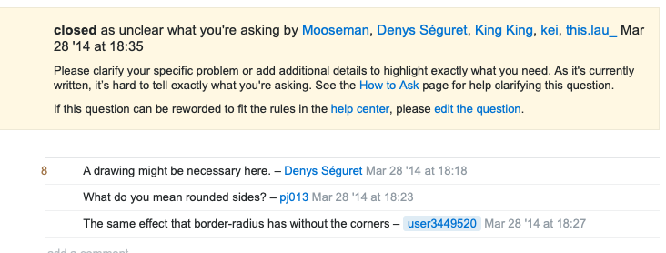
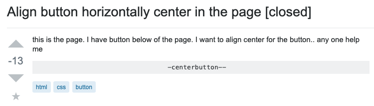
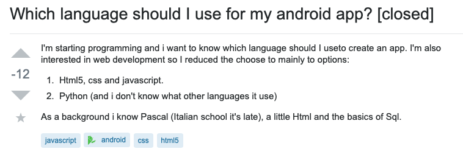
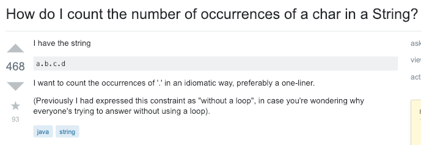
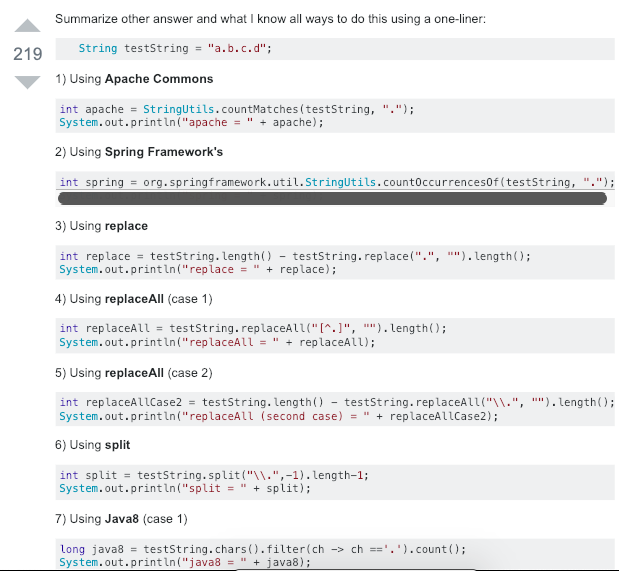

##  The difference between a noob and a newbie
Although both terms mean someone who is unfamiliar with something, the characterizing difference of a noob and a newbie is their attitude and approach for seeking help.

## Noobs (Bad Questions)
One of the characteristics of a bad question is that it is unclear and code or screenshots are not provided.
For example, the question below is confusing and unclear for someone to answer it because how they describe it does not make sense. 

In response, this question was closed because the community was unable to make sense of the question.

Another characteristic of a bad question is one that is already answered in many online resources and can be found through a quick google search. For example, the question below asks something that can be found on [w3schools](https://www.w3schools.com/w3css/w3css_display.asp). 

Another bad question is one that is obvious and can also be found through a quick google search. With a quick search, one can learn that Andriod apps use Java. 

## Newbies (Good Questions)
A good question is one that is general and can be applied to a wide range of situations so that the most people can benefit from the answer. The question below also asks for an alternative way of solving this problem, which gives the community a little challenge instead of answering the simplest way. Also, the goal is clearly specified and an example string is given.

In response, the community listed multiple ways of solving this problem.

