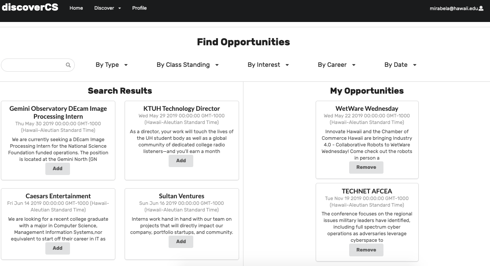

# Overview

[Discover CS](http://discovercs.meteorapp.com/#/) is an app that is supposed to help potential students in CS, particularly underclassmen, explore what is possible with the major. They can explore the various interests categories in three types: technical, subject, and field. Technical interests include languages, frameworks, and technologies. Subject interests are broad subjects such as math and art. Field interests are specific fields in CS such as virtual reality and artificial intelligence. The student can also explore related careers and find friends. Searching for opportunities helps them find scholarships, internships, and events. The student has a personal profile that displays interests, careers, and opportunities they saved. 

Learn  more on the [Discover CS GitHub Page](https://discovercs.github.io/). 

# Contributions

Before starting development on this project, I first created a system outline of all the pages. I outlined what features would be on each page, and created tables descibing the database model. After brainstorming for a bit with my partners, I then started to create tasks and assign them fairly equally among my group.  I drew mock-ups of each page using Adobe Illustrator to help my teammates with understanding the visual layout of each page. 

# Learning Experience

This was the first time I managed other people on an app project. I learned how to utilize my teammates strengths to properly assign tasks. Positive reinforcement and constructive criticism are important in helping us work and communicate well together. It was nice knowing that I could sit by my teammates and help them as problems came up. I surprisingly enjoyed troubleshooting and searching for solutions for bugs. In solving errors, I learned a lot about the nitty-grity details of React, Semantic UI, and Meteor. With each error I learned something new. For each page, we had to think about each component and how the database would interact with the front end. Overall, I learned that I quite enjoy web development. 

