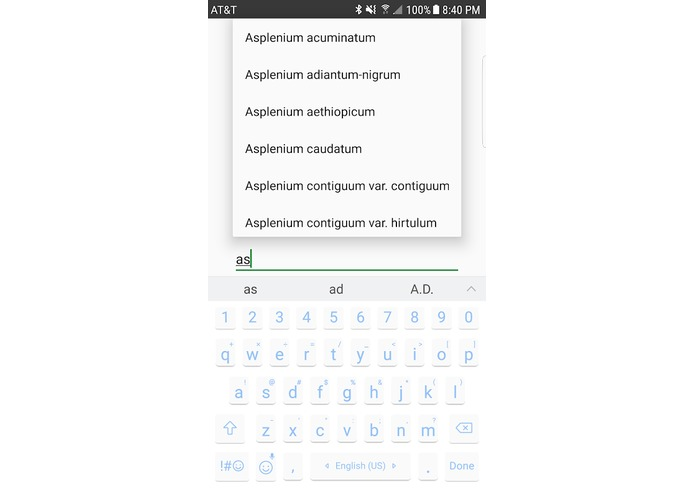
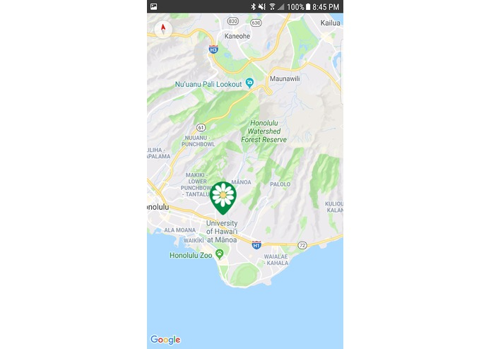

  

## Project Kumu for HACC 2018
Kumu is a two-part system for efficient, user-friendly data reporting and visualization for native Hawaiian plants.
The Kumu system incorporates a pair of two components: Kumu App for data collection, and Kumu Web for data visualization.
I worked on the Branding and Logo, Video, Website & CSS, and some of the Android app.

A full description is at [Devpost](https://devpost.com/software/kumu).

