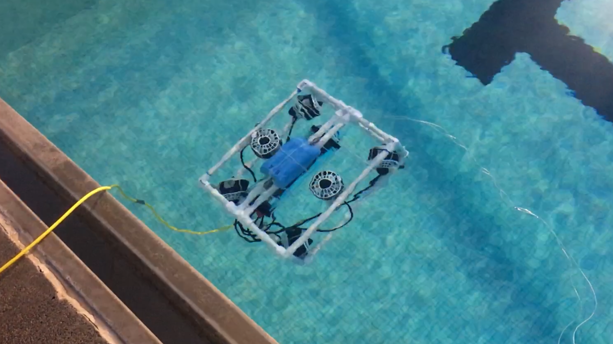

  
  
  
  

Presented at the Spring 2018 Student Undergraduate Research Fair at Kapiolani Community College.
Gained experience with Arduino Uno and building circuits
Tasked with managing the flow of data for the system.
Designed the project logo.

[See it on SlideShare](https://www.slideshare.net/secret/BiwbLTsExv1ASv)
