# Prior Research

In order to understand how to approach the problem of the lack of diversity in the STEM department, I researched on how to make STEM more appealing for women & underrepresented minorities. I summarized my findings in a [presentation](https://docs.google.com/presentation/d/1wrauroYPML3FRxXu9RMC97OBIoRGKsvWbc2U2-l1XSA/edit?usp=sharing) I did for the KCC Student Undergraduate Research Fair Fall 2018 and showed the ideas that I had and my vision for their new website.

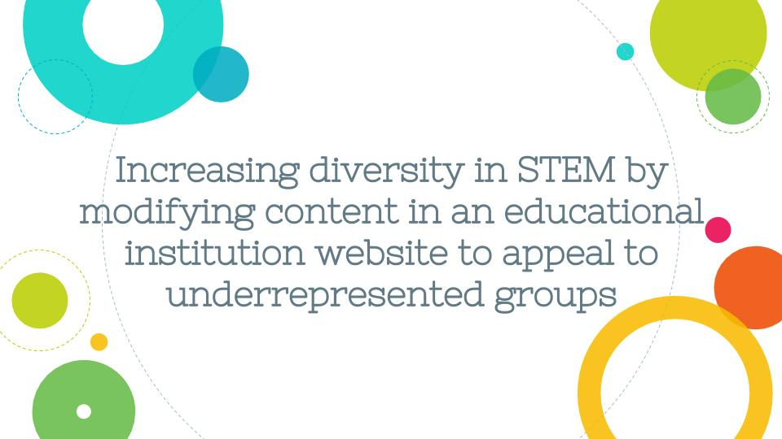
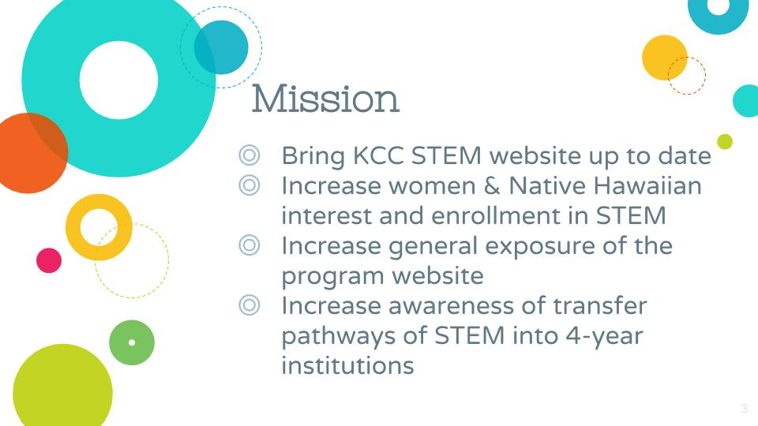
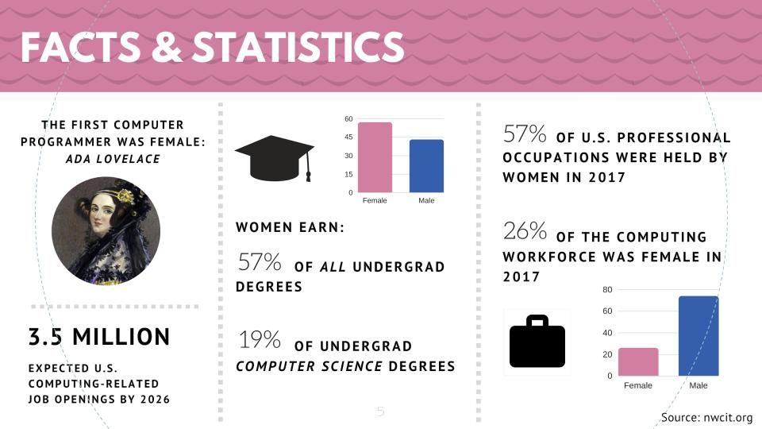
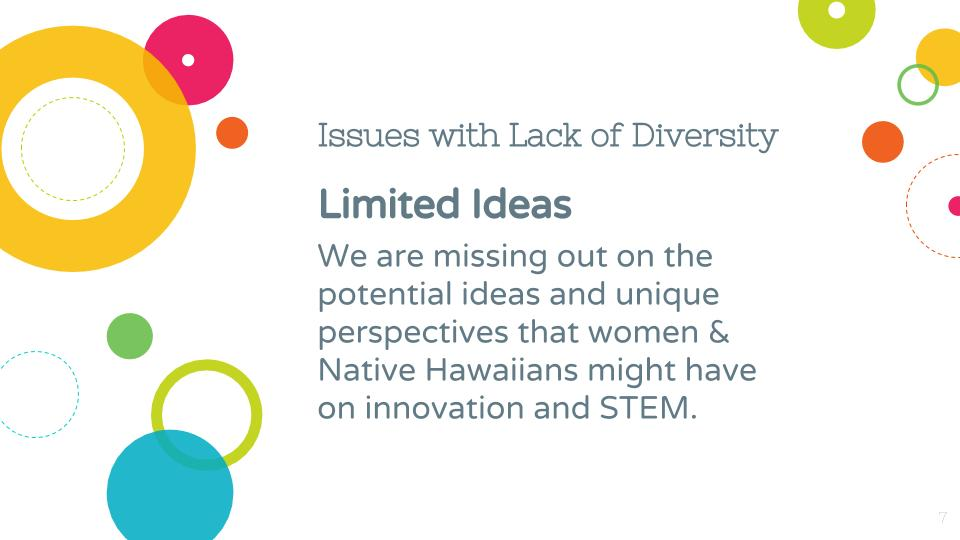
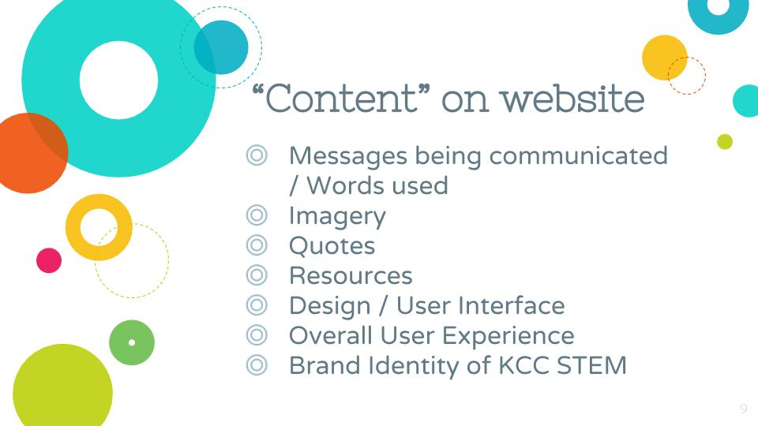
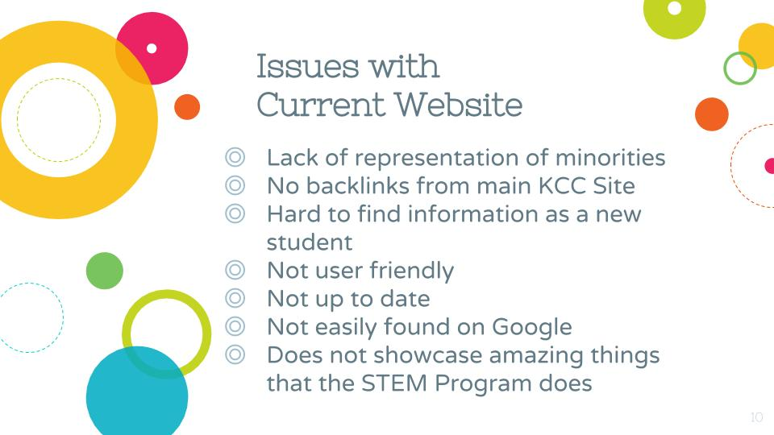
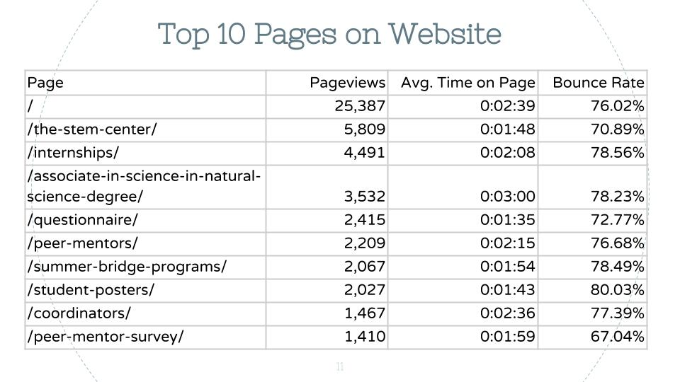
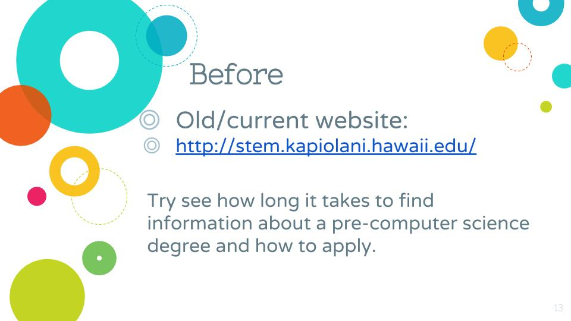
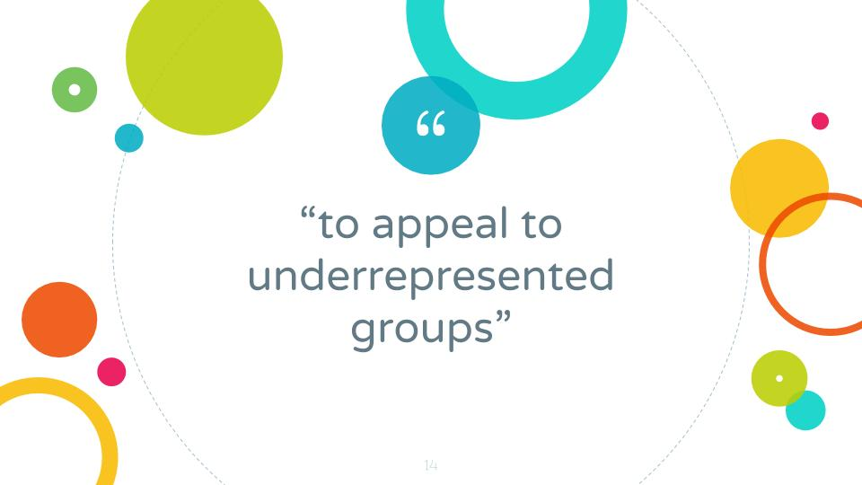
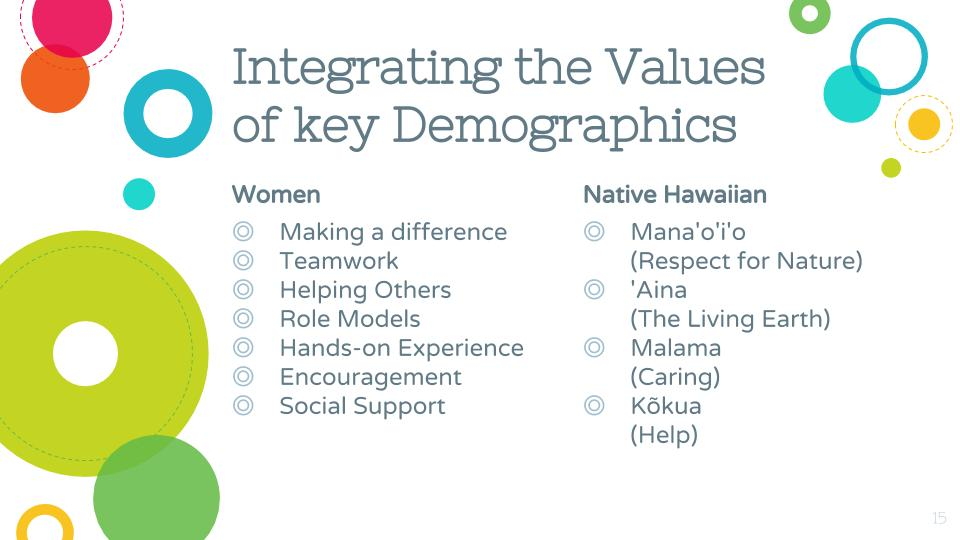
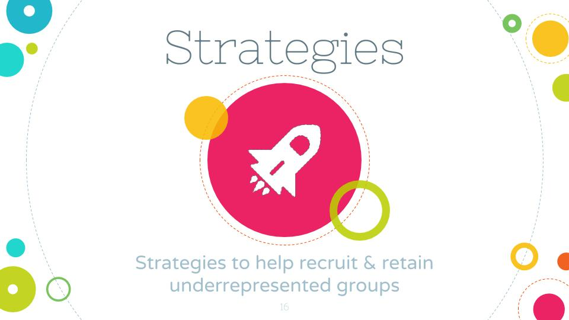
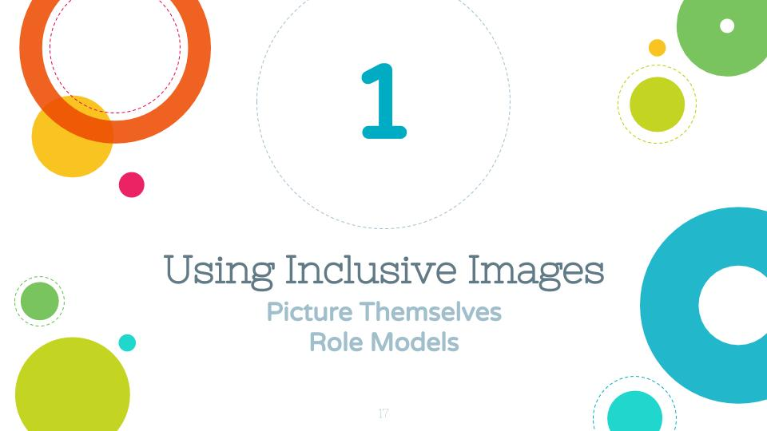
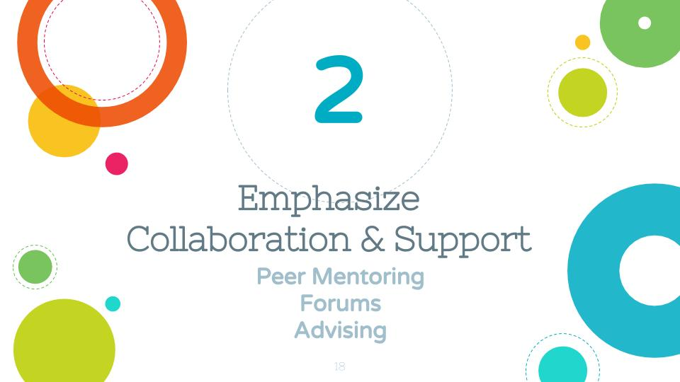
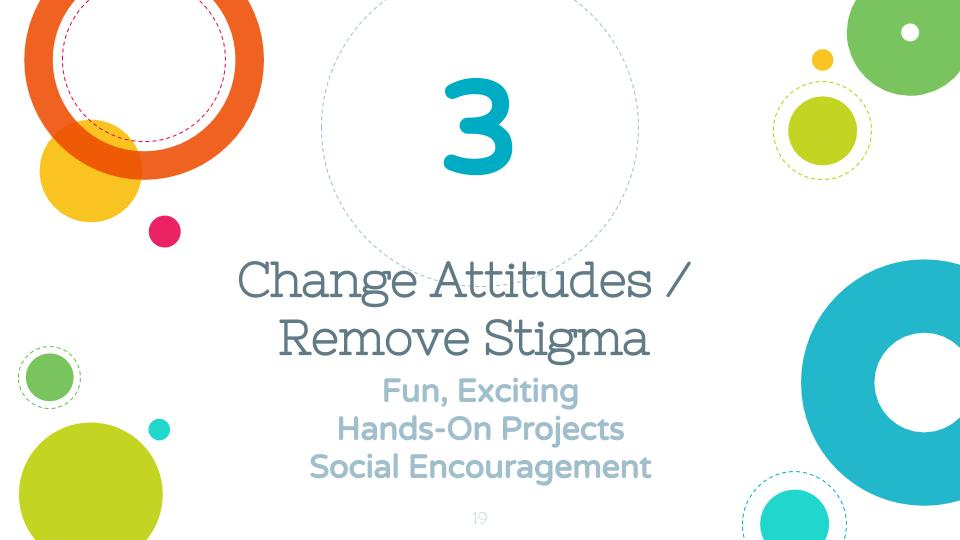
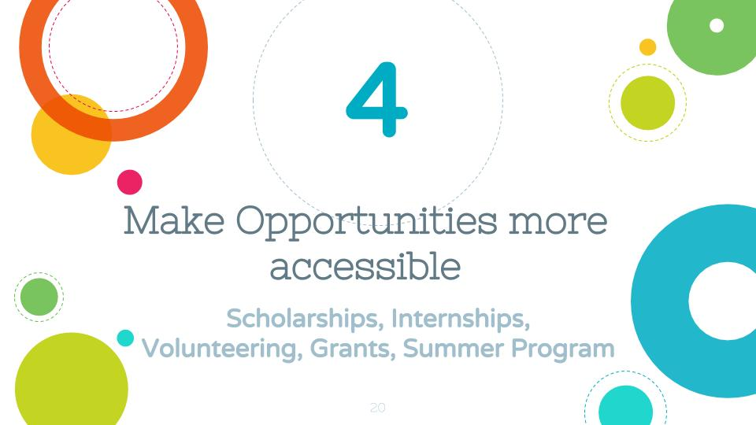
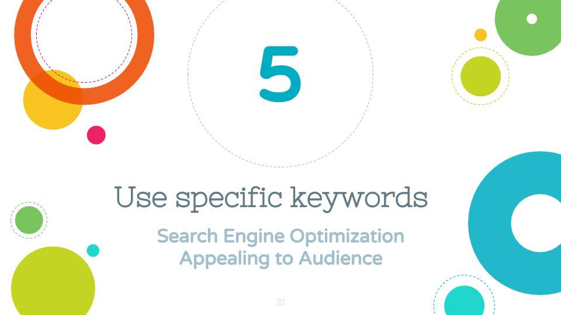

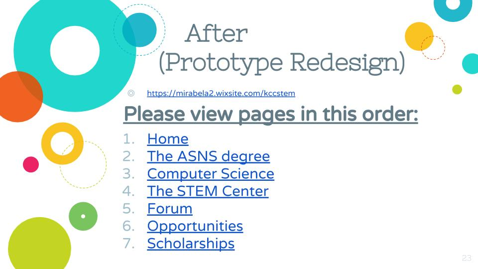
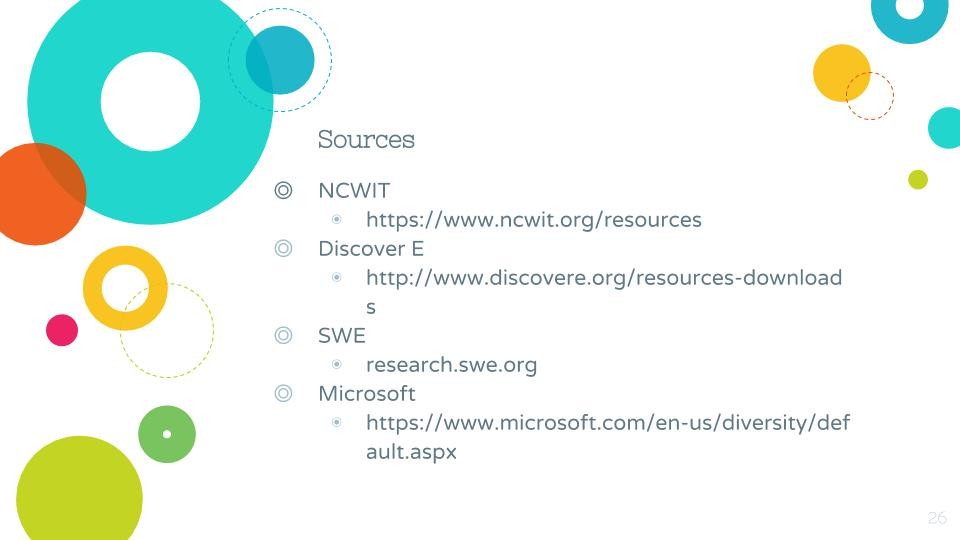

# Old Website 

On the [old website](http://www.stem.kapiolani.edu), across all pages there is a header that features three males, also the navigation bar seems to be stuffed with many links. It also had a lot of outdated information and finding a simple degree sheet took to long.  My goal was make the website more user friendly for new students to explore. Using Google Analytics, I found out the most popular pages of the old website and determined the most important information students were seeking. 

 First, I simplified the navigation bar to four main tabs. I wanted to highlight the important information and the links that students actually cared about. I created individual degree pages for each of the ASNS concentrations. Each of the degree pages, before the breakpoint of the pages, has the most important links: the degree sheet and class availability. Below that is a section which highlights which potential majors the degree will transfer to, and what careers are possible. Below that is a row of images that depict interesting and exciting aspects of the field. Below that are large buttons to scholarships and internships. At the bottom, there is an alumni testimonial that helps encourage potential students to choose the major. 
 
 Throughout the whole website, I made it a point to be careful with the images that I chose. Generally, the first tool humans use to form perceptions is their sense of sight. Being exposed to a certain image frequently is what creates a specific bias and assumption. The way to break perceptions is to present something different from the norm, and show that this is accepted. One of my strategies for improving diversity was changing perceptions by changing images we present. I made sure to be inclusive and show underrepresented minorities in STEM. 
 
 

 

