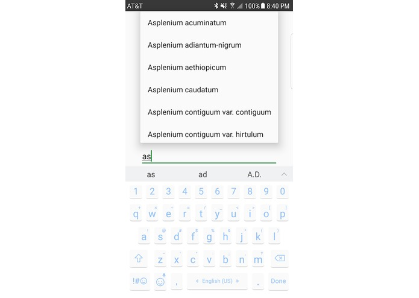

  
  
  

Kumu is a two-part system for efficient, user-friendly data reporting and visualization for native Hawaiian plants.
The Kumu system incorporates a pair of two components: Kumu App for data collection, and Kumu Web for data visualization.
I worked on the Branding and Logo, Video, Website & CSS, and some of the Android app.

Kumu App is a mobile Android app that allows users such as botanists to collect rare plant data on site from anywhere at any time. It streamlines the plant data collection process, incorporating expandable and collapsible fields, auto-completion, draft saving, and automatic data uploading functionality into the app’s data forms. Data collection with Kumu App is done in an effective step-by-step process that also allows users to take up to ten geotagged photos of the plant to attach to the form. Forms are stored locally and automatically synced once an internet connection is detected to allow users to collect plant data regardless of whether there is an internet connection. We kept this in mind for botanists who often travel to remote sites to collect data on plants. Finally, users can also view a map on their app that displays all locations of previously collected data, so that they can easily return to these sites if needed.

Kumu Web is a public website that displays real-time plant data collected throughout the state to show plant revitalization progress. For effective and measurable data visualization, Kumu Web displays a map that pinpoints the locations of all forms collected by Kumu App users. Each plant location point on the map displays the plant's name, data, and a gallery of images taken on site. For added insight, the site displays measurable metrics by including filters that allow users to view specific subsets of plants based on endangerment status, plant maturity, and other identifiers. Designed with the public in mind, Kumu Web clearly displays measurable insights on the state's progress towards native plant revitalization.

A full description is at [Devpost](https://devpost.com/software/kumu).

