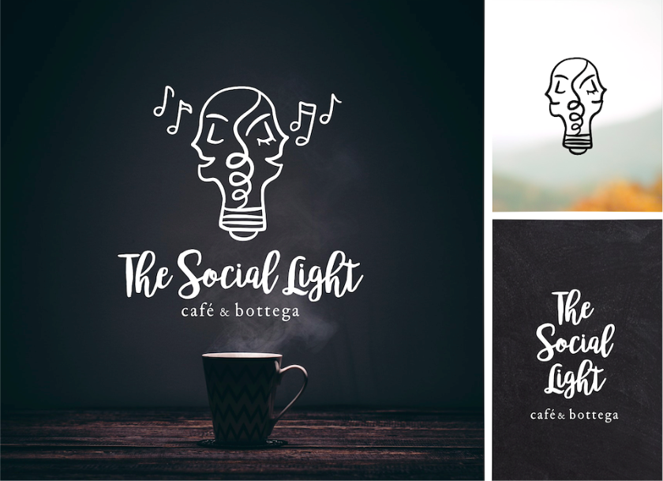

# Graphic Design

## The Freelancing Experience
During high school I was fortunate enough to stuble upon a little [website](99designs.com) that allowed me to grow and practice my skills as a creative. 99designs.com is where startups can go to post graphic design contests to find their next logo. Designers all around the world compete with each other to create the winning design. Because of the fact that I could submit work from anywhere and communicate asynchronously with the clients, I turned my hobby for graphic design into source of extra income (aka a side hustle). 

During the time that I freelanced, I picked up so many valuable skills from interacting with the clients and holding myself to a higher standard since I was competing with all different kinds of designers. In the world of visual design, **communication** is key to understanding the needs of the client. **Conceptual thinking** is needed to communicate ideas and concepts visually on a logo that will symbolize the company goals. **Analytical skills** help you view the perspective of the client and understand their target audience and competing brands. With qualifying rounds lasting only for 72 hours or usually less, **time management** and is essential for producing impressive designs in a limited time frame. 

## 

## Previous Work

## Some of my reviews on [99designs](https://99designs.com/profiles/mirabela/about)

