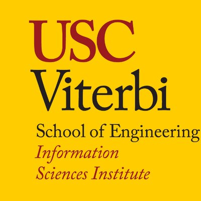

## Summary

**Note: Some details and results are omitted due to sensitive data**

Internship: June 2019 - August 2019

Project for USC ISI REU Site: [Human Communication in a Connected World](https://reu.isi.edu/index.html) Summer 2019. 

Independently created and executed a project for data collection (web scraping & cleaning) and data analysis (natural language processing) for the NSF Project “Coordinating Curricula and User Preferences to Increase the Participation of Women and Students of Color in Engineering” [Award #1826632](https://nsf.gov/awardsearch/showAward?AWD_ID=1826632)

## View the Poster

<object data="https://miraabela.github.io/images/poster.pdf" type="application/pdf" width="100%" height="400px">
    <embed src="../images/poster.pdf">
        
<a href="https://miraabela.github.io/images/poster.pdf">Download PDF</a>

    </embed>
</object>

## Overview 
Mindmap of Workflow (Click & Drag):

<iframe width="100%" height="400px" src="https://atlas.mindmup.com/2019/07/25a29970acd711e98514ff596ba192be/reu_workflow/index.html"></iframe>

#### Data Collection: Web Scraping & Cleaning:

- Library/Frameworks/Tools used: 
    - [Scrapy](https://scrapy.org/), [Scrapy Selectors](https://docs.scrapy.org/en/latest/topics/selectors.html), [re](https://docs.python.org/3/library/re.html)
    - [CSS](https://www.w3schools.com/cssref/css_selectors.asp) & [XPath](https://devhints.io/xpath) Selector Reference, [XPath tester](http://xpather.com/)
    
#### Natural Language Processing

- Library/Frameworks/Tools used: 
    - [NLTK](https://www.nltk.org/), [matplotlib](https://matplotlib.org/), [wordcloud](https://github.com/amueller/word_cloud), [NumPy](http://numpy.org/), [pandas](https://pandas.pydata.org/)
    - [Scikit-learn](https://scikit-learn.org/stable/), [Gensim](https://radimrehurek.com/gensim/)
    
    
## Data Collection Results

- 4222 reviews on USC & UHM  Computer Science & Engineering professors
- 4244 course sections from USC Schedule of Classes
	- 1212 syllabi (.doc & .pdf)

